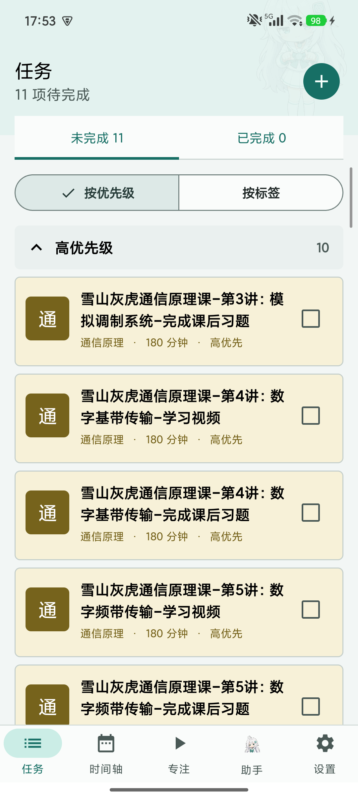
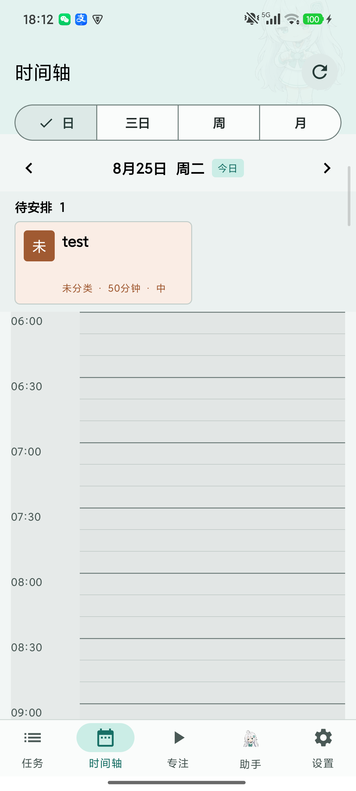
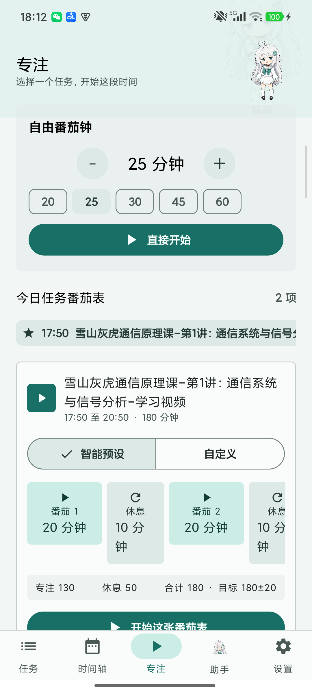
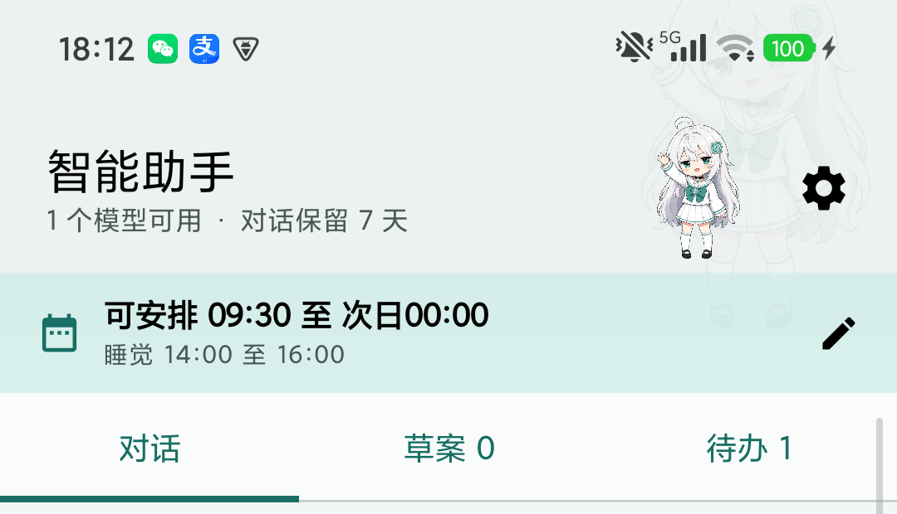

# 自律计划（FocusPlan）

面向个人侧载到 Xiaomi HyperOS 的本地优先 Android 自律与规划应用。数据保存在本机，不需要自建后端。

## 主要功能

- 任务：统一详情卡片、已完成/未完成分页、三级优先级或标签分组、自定义标签、批量选择与删除。
- 时间轴：日、三日、周、月视图，日视图采用 10 分钟网格，规划范围为 06:00 至次日 02:00。
- 自由排程：待办任务可作为任务块插入时间轴，支持退回、回收和历史日期只读。
- 排除时段：睡觉、午休等预设不算任务；所有日视图按当天生效的历史版本显示，三日、周、月视图不显示，排程会主动避开。
- 专注：自由番茄钟、按今日任务生成番茄表、自定义专注与休息分块、音乐通知。
- 严格模式：通过无障碍服务、使用情况访问和应用白名单提供离开提醒。
- 智能助手：支持 OpenAI-compatible 多模型配置、快速模型切换、正常对话、分天任务草案、草案/本地任务批量管理及一键智能排程。
- 智能排程：模型只给出任务顺序与建议日期，本地确定性排程器负责整块落位、冲突校验、排除时段和超时回退。
- 状态化 UI：浅色/深色主题、角色状态反馈、可拖拽轻量 GPT 娘宠物、自适应桌面图标和手机/横屏导航。

## 应用截图

| 任务 | 时间轴 | 专注 |
| --- | --- | --- |
|  |  |  |

| 智能助手 |
| --- |
|  |

## 已验证环境

目前只在以下一台真机上完成安装和功能验证：

- 设备：Xiaomi Civi 3（型号 `23046PNC9C`）
- 系统：Android 15 / API 35
- ROM：Xiaomi HyperOS OS3.0，版本 `OS3.0.10.0.VMICNXM`

其他 Xiaomi/HyperOS 版本、MIUI、原生 Android 以及其他品牌 ROM 均未验证。不同系统的权限入口和后台限制可能不同，通知、自启动、后台运行、无障碍服务、使用情况访问和电池优化等能力可能需要自行修改或适配。本项目不声明兼容所有 Android 设备。

## 开发与打包平台

推荐在 Windows 10/11 使用 Android Studio（Ladybug 或更新稳定版）开发和打包。项目是标准 Kotlin/Jetpack Compose Android 工程，也可在 macOS 或 Linux 构建。

需要：

- JDK 17（Android Studio 自带的 JBR 17/21 也可以）
- Android SDK Platform 35
- Android SDK Build-Tools 35.0.0
- Android SDK Platform-Tools（安装到手机时需要 `adb`）
- Gradle Wrapper（项目已提供，运行 `gradlew.bat`，无需全局 Gradle）

Android Studio 打开项目后，等待 Gradle Sync 完成，连接已开启 USB 调试的小米手机，点击 Run 即可。HyperOS 首次安装还需允许“通过 USB 安装”；番茄钟和离开提醒需要额外允许通知、自启动、后台运行及使用情况访问权限。

命令行构建调试 APK：

```powershell
.\build-debug.ps1
```

脚本会运行单元测试、Lint 和 Debug 构建，输出位置为 `dist/FocusPlan-0.2.0-debug.apk`。`dist` 不纳入 Git，发布包见 GitHub Releases。

若 PowerShell 阻止本地脚本，可在当前窗口执行：

```powershell
Set-ExecutionPolicy -Scope Process Bypass
.\build-debug.ps1
```

## 安装

从 Releases 下载 APK，允许 HyperOS 的“安装未知应用”后进行侧载。通过 Android Studio 热调试时，还需要在开发者选项中启用 USB 调试和 USB 安装。

当前 Release 使用 Android Debug Key 签名，适合个人测试，不用于应用商店发布。更换电脑或签名密钥后，可能无法直接覆盖旧安装包。

## 隐私与边界

- 数据只保存在本机 Room 数据库，不需要账号或后端。
- 模型 API Key 经 Android Keystore 保护，助手仅在请求模型时联网。
- 严格模式不是系统级不可绕过锁机，通过使用情况访问、可选无障碍服务和白名单实现离开警告。
- AI 只负责理解和建议，确定性的本地排程器负责生成无冲突时间块。

## 美术说明

角色美术基于项目所有者指定的 [Whom001x/-](https://github.com/Whom001x/-) 参考素材进行适配。FocusPlan 是个人学习项目，与 OpenAI 无官方关联。
